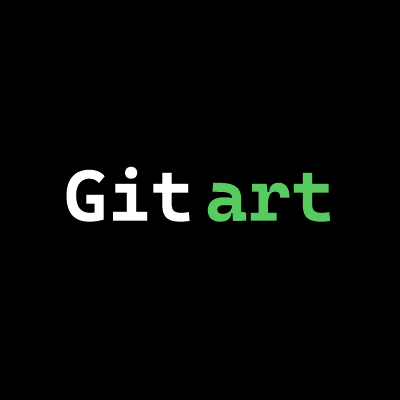

# Gitart

**Terminal-style AI website builder on RobinHood.**

Build websites like you run commands — create, customize, and deploy through a pure terminal workflow.

<p align="center">
  
</p>

<p align="center">
  <a href="https://gitart.xyz"><strong>Live site → gitart.xyz</strong></a>
  &nbsp;·&nbsp;
  <a href="https://github.com/Gitart-tech/gitart-robinhood">GitHub</a>
</p>

---

## Features

| Feature | Description |
|--------|-------------|
| **AI generation** | Describe an idea — get Hero, Tokenomics, Roadmap, and more |
| **Terminal UI** | Full CLI-style interface (no drag-and-drop) |
| **RobinHood chain** | Wallet connect + mint project as NFT |
| **Theme commands** | `gitart theme "cyberpunk"` and more |
| **Instant deploy** | One command to a live URL |
| **Stock logos** | On-demand web photos by keyword (`create logo "dog"`) |

## Quick start

```bash
npm install
npm run dev
```

Open [http://localhost:5173](http://localhost:5173)

```bash
npm run build
npm run preview
```

## Core commands

```text
gitart create "your website idea"
gitart preview
gitart edit [section] "instruction"
gitart add section "name"
gitart remove [section]
gitart theme "style"
gitart deploy
gitart connect-robinhood
gitart mint
gitart create logo "dog"
```

## Project structure

```text
├── api/                 # Serverless: POST /api/generate-logo
├── assets/              # Brand images (avatar, OG)
├── docs/                # Optional AI image API setup
├── public/              # Favicon & static files
├── server/              # Image providers (stock + optional AI)
├── src/
│   ├── components/      # UI sections + terminal
│   ├── config/site.ts   # CA, social links, domain
│   └── lib/             # Helpers
├── vercel.json
└── vite.config.ts
```

## Configuration

Edit `src/config/site.ts`:

```ts
export const SITE = {
  name: 'Gitart',
  chain: 'RobinHood',
  domain: 'https://gitart.xyz',
  contractAddress: 'Coming Soon',
  contractLive: false,
  social: {
    x: 'https://x.com/...',
    github: 'https://github.com/Gitart-tech/gitart-robinhood',
  },
}
```

## Logo / image command

By default, images are **real web photos fetched on demand** (no AI key required):

```text
gitart create logo "dog"
gitart create logo "cat"
```

Optional AI providers (Gemini / Hugging Face / xAI): see [docs/IMAGE_API_SETUP.md](docs/IMAGE_API_SETUP.md).

## Deploy

### Vercel

```bash
npm i -g vercel
vercel --prod
```

Or connect this repo in the Vercel dashboard and set domain **gitart.xyz**.

### Env (optional)

```env
# USE_AI_IMAGE=1
# GEMINI_API_KEY=
# HF_TOKEN=
# XAI_API_KEY=
```

`.env` is gitignored — never commit secrets.

## Stack

- **Vite** + **React** + **TypeScript**
- **Tailwind CSS** v4
- **JetBrains Mono**
- Deploy: **Vercel**

## License

MIT — see project owner terms for brand assets.

---

<p align="center">
  <code>Build websites like you run commands.</code><br/>
  <sub>Built on RobinHood · Powered by AI</sub>
</p>
